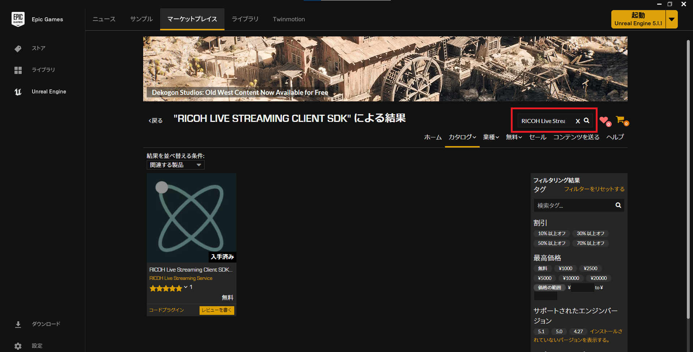
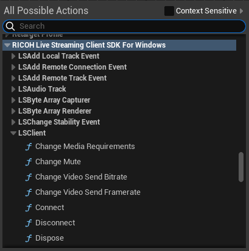

# RICOH Live Streaming Client SDK for Windows Unreal Engine プラグインの利用方法

この文書では、Unreal Engine のプロジェクトで RICOH Live Streaming Client SDK for Windows Unreal Engine プラグイン （以下プラグインと表記）を利用する方法を説明します。

## プラグイン準備

### プラグインのインストール
1. Epic Games Launcher を起動し、「Unreal Engine」、「マーケットプレイス」の順にクリックする。
  

2. 「アセットを検索...」欄に「RICOH Live Streaming Client SDK」を入力し、プラグインを検索する。
  

3. [Unreal Engine マーケットプレイスからプラグインをインストールする](https://docs.unrealengine.com/5.1/ja/working-with-plugins-in-unreal-engine/#unrealengine%E3%83%9E%E3%83%BC%E3%82%B1%E3%83%83%E3%83%88%E3%83%97%E3%83%AC%E3%82%A4%E3%82%B9%E3%81%8B%E3%82%89%E3%83%97%E3%83%A9%E3%82%B0%E3%82%A4%E3%83%B3%E3%82%92%E3%82%A4%E3%83%B3%E3%82%B9%E3%83%88%E3%83%BC%E3%83%AB%E3%81%99%E3%82%8B) の手順に従ってプラグインをインストールする。

### プラグインのインストール場所  
プラグインは下記のフォルダにインストールされます。  
C:\Program Files\Epic Games\[UEバージョン]\Engine\Plugins\Marketplace\LiveStreaming_ClientSDK

## Unreal Engine プロジェクト準備

### プラグインの有効化  
1. [プロジェクト名].uproject を開き、Unreal Editor を起動する。

2. メニューの「Edit」 > 「Plugin」 を選択する。  
  

3. 「RICOH Live Streaming Client SDK for Windows」のチェックが OFF の場合は ON にする。  
  

4. チェックを ON に設定後、下記メッセージが表示された場合は Unreal Editor を再起動する。
  

### ビルド設定  
C++コードでプラグインを使用する場合は、[プロジェクト名]/Source/[プロジェクト名]/[プロジェクト名].Build.cs に下記 (★) の設定を行う。

``` cs
public class ExampleApp : ModuleRules
{
    public ExampleApp(ReadOnlyTargetRules Target) : base(Target)
    {
        PCHUsage = PCHUsageMode.UseExplicitOrSharedPCHs;

        // "LiveStreaming_ClientSDK" を追加する (★)
        PublicDependencyModuleNames.AddRange(new string[] { "Core", "CoreUObject", "Engine", "InputCore", "OpenSSL", "LiveStreaming_ClientSDK" });
```

## プラグイン使用例
Blueprint での使用例は [360度映像表示サンプル](https://github.com/ricoh-live-streaming-api/windows-sdk-samples/tree/main/unrealengine-samples/EquirectangularView) をご参照ください。  
Blueprint のカテゴリーは、「RICOH Live Streaming Client SDK for Windows」です。  
  
